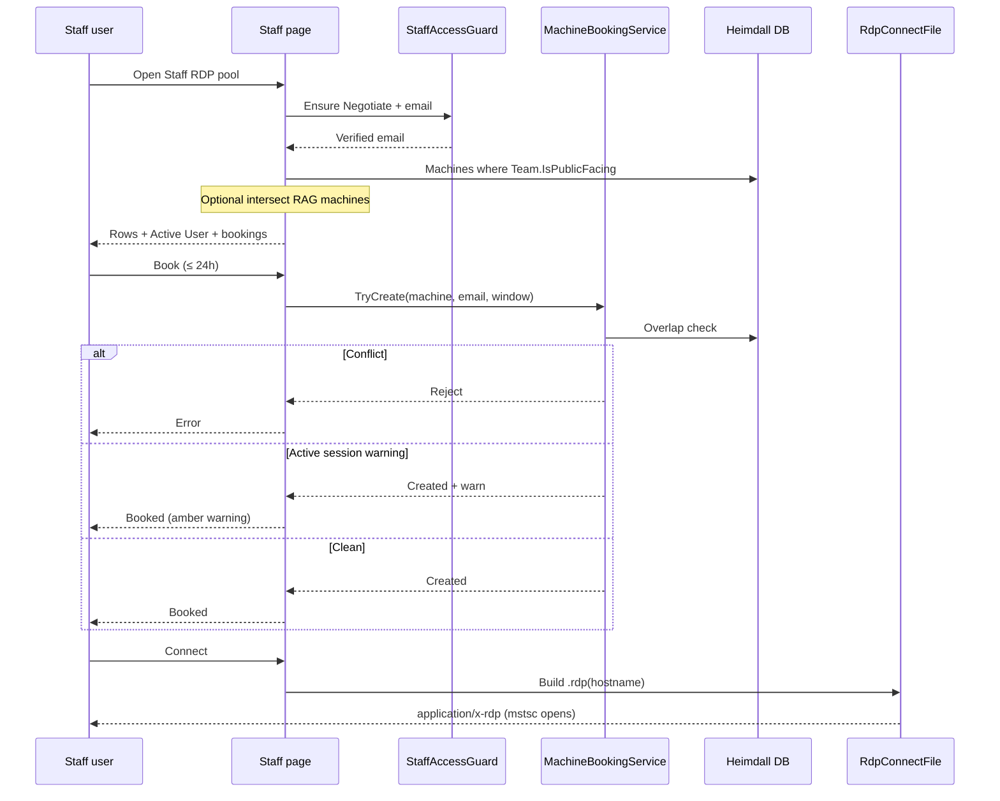

# Phase 1 — Ops console + Staff RDP booking

**Status:** Ready to implement (locked decisions)  
**Repo:** `C:\Heimdall`  
**Phase label:** **1B** (IA / Ops + Staff surfaces) + **2A** (RDP Connect + booking) shipped together as Phase 1  
**Auth:** Keep existing Windows Negotiate on Staff Access — **SSO / Entra hardening is later (non-goal)**

---

## Overview

Heimdall’s DT-facing machine UI is sprawled across Machines / Sessions / Online Status / Client Version (and Cost/Stats in Admin). Phase 1 consolidates **Digital Technology ops** into a single **Ops** page with tabs, reshapes **Staff Access** into a **public RDP pool + booking** surface, and keeps **TUFLOW / flood fleet** in a gated non-public area.

| Track | Outcome |
|--------|---------|
| **Ops (1B)** | One `/Ops` page; prune top nav; old routes redirect |
| **Staff RDP (2A)** | Pool filtered by `Team.IsPublicFacing`; status + booking ≤ 1 day; Connect opens `.rdp` |
| **TUFLOW** | Stays separate; nav/pages gated to flood/admin emails |
| **Later** | Entra SSO; full analytics redesign (usage tracking polish stays backlog) |

### Sensible defaults (no further questions)

| Decision | Default |
|----------|---------|
| Ops URL | `/Ops` with query/hash or path segment tabs; **old routes 302 → Ops tab** |
| Team visibility | `Team.IsPublicFacing` on entity; staff pool = machines with `Machine.TeamId` → public team |
| RAG vs public flag | **Primary:** public team flag. **Optional refinement:** if user is in any Remote Access Group, further intersect RAG machines ∩ public-team machines; if user has **no** RAG membership, show **all** public-team machines (authenticated staff). Admins / AdminEmails always see full pool. |
| Booking store | New DB table `MachineBooking`; max duration **24 hours**; one active booking per user per machine optional soft rule (allow cancel/replace) |
| Bookable policy | Bookable when session is **Disconnected / Idle / unknown-offline**; if **Active** user present → allow book with **warning**, Connect still allowed (ops may need break-glass) |
| Active User UI | Green = Active session user present; Red/amber = booked conflict or Active blocking preference |
| RDP Connect | Reuse `RemoteMachines` `.rdp` file response; prefer `Content-Disposition: inline` / browser open (same `application/x-rdp` pattern) over “download only” messaging |
| TUFLOW gate | `Heimdall:StaffAccess:AdminEmails` **union** optional `Heimdall:FloodTeamEmails`; hide Flood/TUFLOW nav + return 403 on pages if not matched |
| Auth | Phase 1 keeps Negotiate + existing Staff cookie/email flow |

---

## Phase 1 scope / non-goals

### In scope

1. **Ops page** consolidating DT machine ops tabs + redirects from legacy URLs.
2. **Nav prune** — Ops / Applications / Staff / Flood (gated) / Admin.
3. **`Team.IsPublicFacing`** + Teams UI toggle.
4. **Staff RDP pool** (reshape Staff Access + Staff group pages) with live status, booking, Connect `.rdp`.
5. **Booking service** (create / cancel / conflict check) + EF entity/migration (or EnsureCreated schema bump consistent with repo).
6. **TUFLOW / Historical / Fleet** gating + nav move under Flood.
7. Help copy updates for Ops / Staff booking / Connect.

### Non-goals (explicitly later)

- Entra ID / SSO / app registration hardening.
- Full analytics redesign (popular vs single-user, processing-non-Explorer classification UX, Windows Core/SOE ignore lists polish) — keep existing Apps/Discovery/Socratize as-is under Applications.
- Changing agent ingest / heartbeat contracts beyond what booking UI already reads from session state.
- Merging TUFLOW into Staff or making flood machines public-facing.
- Multi-day bookings, calendar invites, Outlook integration.

---

## Ops tab map

**Route:** `/Ops` → Razor Page `Pages/Ops.cshtml` (+ `Ops.cshtml.cs`)  
**Tabs** (concrete set):

| Tab key | Label | Source today | Notes |
|---------|--------|--------------|--------|
| `machines` | All machines | `/` (`Index`) | Default tab; keep Index content as partial or rewrite Index to redirect |
| `sessions` | Sessions | `/Sessions` | Session list / active users |
| `online` | Online status | `/RemoteMachines` | Ping / RDP probe / Connect (ops still needs Connect) |
| `clients` | Client version | `/ClientVersion` (and `/Clients` if still used) | Agent version matrix |
| `cost` | Cost | `/Cost` | Secondary; keep under Ops not Admin |
| `stats` | Stats | `/Stats` | Secondary |

**Redirects (302):**

| Old | New |
|-----|-----|
| `/` (optional: keep brand home → Ops machines **or** redirect Index → `/Ops`) | **Default:** `Index` becomes thin redirect to `/Ops?tab=machines` so brand “Heimdall” lands on Ops |
| `/Sessions` | `/Ops?tab=sessions` |
| `/RemoteMachines` | `/Ops?tab=online` |
| `/ClientVersion`, `/Clients` | `/Ops?tab=clients` |
| `/Cost` | `/Ops?tab=cost` |
| `/Stats` | `/Ops?tab=stats` |

**Implementation approach (default):** Single `Ops` page with tab query `?tab=`; extract existing page bodies into `Pages/Shared/Ops/_*.cshtml` partials and thin page models that reuse existing handlers where possible. Prefer moving handler methods onto `OpsModel` (or shared services) rather than iframes.

**Stay out of Ops (remain their own surfaces):**

- **Teams** — Admin org mapping + `IsPublicFacing` toggle
- **Applications** dropdown (Apps, App lists, Discovery, Socratize, Track Software)
- **Machine detail** `/Machine` — deep link from Ops rows unchanged
- **Flood/TUFLOW** area (below)

---

## Staff RDP + booking + Team public flag

### Team flag

- Add `bool IsPublicFacing { get; set; }` to `Team` in `Data/Entities.cs`.
- Expose checkbox on `Pages/Teams.cshtml` (+ page model save).
- Machines inherit visibility via existing `Machine.TeamId` (already on entity).

### Staff surface reshape

| Today | Phase 1 |
|-------|---------|
| `StaffAccess` sign-in → pick RAG → `Staff/{id}` live metrics | **Staff** = RDP **pool** of public-team machines (+ optional RAG intersect) |
| Live sampling / favourites on Staff page | Keep live metrics as secondary collapsible **or** link “Live metrics” only for RAG-assigned machines (default: show pool table first; live bar can remain if already wired) |

**Primary Staff UX (2A):**

1. Authenticate (existing Negotiate / StaffAccessGuard).
2. List machines: public teams only (see ACL default above).
3. Per row: hostname/friendly name, team, **Active User** (green/red), **Booking** window, **Book** / **Cancel**, **Connect**.
4. **Connect** → same `.rdp` generator as `RemoteMachinesModel.OnGetConnectRdp` (extract shared helper).

### Booking model

```csharp
public class MachineBooking
{
    public int Id { get; set; }
    public int MachineId { get; set; }
    public Machine Machine { get; set; } = null!;
    public required string BookedByEmail { get; set; }
    public DateTimeOffset StartUtc { get; set; }
    public DateTimeOffset EndUtc { get; set; }  // Start + ≤ 24h
    public DateTimeOffset CreatedUtc { get; set; }
    public string? Notes { get; set; }
}
```

**Conflict rules:**

- Reject if another booking overlaps `[StartUtc, EndUtc)`.
- If machine has **Active** interactive session (from existing session/ingest state): allow create with UI warning; optionally block Connect soft-warn only (default: **warn, do not hard-block Connect**).
- Bookable “clean” when Disconnected / Idle / no recent Active user.

**UI:** duration picker up to 1 day (e.g. 1h / 2h / 4h / 8h / end-of-day / custom ≤ 24h).

### RDP Connect (2A)

- Extract `RdpFileResult` helper from `RemoteMachines.cshtml.cs` → e.g. `Services/RdpConnectFile.cs`.
- Wire Connect on Staff pool + Ops Online tab.
- Prefer launch: serve `application/x-rdp` with filename `host.rdp` (existing pattern opens mstsc via file association). Document in Help that browser download/open is required (cannot invoke `mstsc` directly).

---

## TUFLOW gating

**Pages to gate (403 + hide nav):**

- `/TuflowRuns`
- `/FleetSimProgress`
- `/HistoricalDashboard`
- `/HistoricalDashboardMachine`
- Machine-page TUFLOW panel: hide controls unless gated user (read-only status optional for ops — **default: hide start/stop for non-flood**)

**Gate helper:** e.g. `FloodAccessGuard` using:

```json
"Heimdall": {
  "StaffAccess": { "AdminEmails": [ "..." ] },
  "FloodTeamEmails": [ "flood.user@arup.com" ]
}
```

Match: normalized email from Windows/Staff identity ∈ AdminEmails ∪ FloodTeamEmails (case-insensitive). Dev bypass may follow StaffAccess `AllowDevBypass` when in Development.

**Nav:** top-level **Flood** dropdown (only if gate passes): Historical Dashboard, TUFLOW Runs, Fleet Sim Progress.

---

## Nav prune

**Target header (`_Layout.cshtml`):**

| Nav | Items |
|-----|--------|
| **Ops** | Link to `/Ops` (no Machines mega-menu) |
| **Applications** | Unchanged set |
| **Staff** | `/StaffAccess` (or rename label “Staff RDP”) |
| **Flood** | Gated — Historical / TUFLOW / Fleet |
| **Admin** | Teams, Remote Access Groups, Tracking config, Utilization, Theme, Help, DB mode — **remove Cost/Stats** (moved to Ops) |

Remove from nav (redirects remain): All machines, Sessions, Client Version, Online Status as top-level entries.

---

## Key files

| Area | Paths |
|------|--------|
| Layout / nav | `src/Heimdall.Api/Pages/Shared/_Layout.cshtml` |
| Ops (new) | `Pages/Ops.cshtml`, `Ops.cshtml.cs`, `Pages/Shared/Ops/_*.cshtml` |
| Legacy pages | `Index`, `Sessions`, `RemoteMachines`, `ClientVersion`, `Clients`, `Cost`, `Stats` → redirect or partial hosts |
| Team flag | `Data/Entities.cs` (`Team`), `Data/HeimdallDbContext.cs`, `Pages/Teams.cshtml(.cs)` |
| Booking | New entity + `Services/MachineBookingService.cs`; Staff UI |
| Staff | `Pages/StaffAccess.cshtml(.cs)`, `Pages/Staff.cshtml(.cs)`, `Services/StaffAccessGuard.cs`, `Services/RemoteAccessGroupService.cs` |
| RDP | `Pages/RemoteMachines.cshtml.cs` → extract `Services/RdpConnectFile.cs` |
| TUFLOW gate | New `Services/FloodAccessGuard.cs`; `TuflowRuns`, `FleetSimProgress`, `HistoricalDashboard*`; `appsettings.json` |
| Config | `appsettings.json` / `appsettings.Development.json` — `FloodTeamEmails` |
| Help | `Pages/Help.cshtml` |
| Session state for Active User | Existing ingest / `SessionState` / machine online services (`RemoteMachineService`, session queries on Sessions page) |

---

## Implementation todos (ordered)

1. **Schema:** Add `Team.IsPublicFacing`, `MachineBooking` + DbContext config + ensure schema apply path used by this repo.
2. **Teams UI:** Toggle `IsPublicFacing`; seed/docs note for which teams are public.
3. **RDP helper:** Extract shared Connect `.rdp` from `RemoteMachines`; call sites Ops + Staff.
4. **Booking service:** Create/cancel/list/conflicts; max 24h validation; unit-ish tests if project has test project (else manual checklist).
5. **Staff pool UI:** Reshape Staff Access / Staff pages — public machine query, Active User indicator, Book/Cancel, Connect; keep Negotiate auth.
6. **Ops page:** Build `/Ops` + tab partials; move Cost/Stats into tabs; wire Online tab to existing RemoteMachines behavior.
7. **Redirects:** Legacy routes → `/Ops?tab=…`; Index → Ops machines.
8. **Nav prune:** Rewrite `_Layout` dropdowns; Staff + gated Flood.
9. **Flood gate:** `FloodAccessGuard` + apply to TUFLOW/Historical/Fleet pages + Machine TUFLOW panel; add `FloodTeamEmails` config.
10. **Help + smoke:** Update Help; manual matrix (ops tabs, staff book/connect, non-flood 403, admin sees Flood).

---

## Staff booking flow



---

## Success criteria

- DT users land on **one Ops page** with the six tabs; old URLs still work via redirect.
- Staff (Negotiate) see **only public-team machines** (plus RAG refine if configured), can **book ≤ 1 day**, see **Active User**, and **Connect** via `.rdp`.
- Non-flood users **do not** see Flood/TUFLOW nav and get **403** on those routes.
- AdminEmails (and FloodTeamEmails) retain flood tooling.
- No Entra/SSO work in this phase.

---

## Out of band / follow-ups (not Phase 1)

- Usage tracking UX (active vs disconnected vs processing non-Explorer).
- Windows Core + SOE baseline noise tuning UI.
- Popular vs single-user machine analytics.
- Entra SSO replacing Negotiate cookie email flow.
